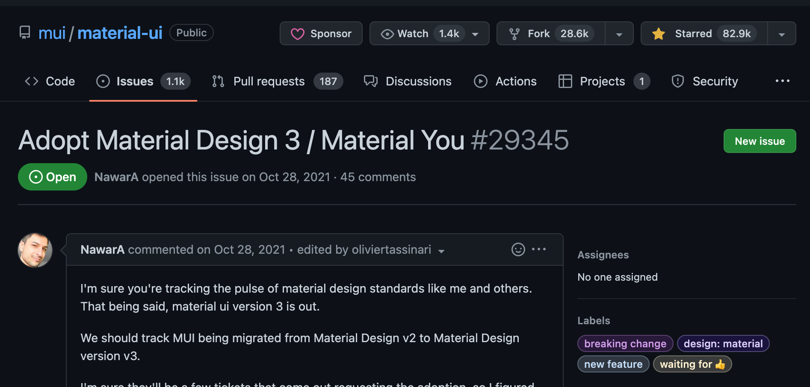

HiCoder LIT #4

# **Material UI のカラーテーマ設定についての覚書**

2022/12/02 @keigomichi

---

## テーマ管理

1. カラーパレットをカスタマイズする
2. ダークモードに対応する
3. デバイスのテーマ設定を使う

---

## Material UI とは

### 2021 年に名称が変更

> Material UI: the organization is now called MUI.
> Material UI: the set of foundational MIT React components is now called MUI Core.
> Material UI: the Material Design components developed by MUI. Also, we ditched the hyphen!

<!-- 引用: [Material UI is now MUI! - MUI](https://mui.com/blog/material-ui-is-now-mui/) -->

### Material UI は Material Design を実装したもの

> Material UI is a library of React UI components that implements Google's Material Design.

<!-- 引用: [Overview - Material UI](https://mui.com/material-ui/getting-started/overview) -->

---

## 1. カラーパレットをカスタマイズする

Material UI v5 では、M2 が実装されているため、デフォルトのカラーシステムも M2 に準拠する

### `createTheme` 関数

引数として `options` をとり、戻り値を `ThemeProvider` の prop として渡す

### `ThemeProvider` (コンポーネント)

prop にテーマをとり、ラップしているコンポーネントにテーマを適用するためのコンポーネント

---

```js
const theme = createTheme({
  palette: {
    primary: {
      main: "#3f50b5",
    },
  },
});

function App() {
  return (
    <ThemeProvider theme={darkTheme}>
      <CssBaseline />
      <main>This app is using custom theme</main>
    </ThemeProvider>
  );
}
```

<!-- 参照: [Theming - Material UI](https://mui.com/material-ui/customization/theming/) -->
<!-- 参照: [Color - Material UI](https://mui.com/material-ui/customization/color/) -->

---

## 2. ダークモードに対応する

`createTheme` の `palette` の `mode` を `dark` に設定する

```js
const darkTheme = createTheme({
  palette: {
    mode: "dark",
  },
});

function App() {
  return (
    <ThemeProvider theme={darkTheme}>
      <CssBaseline />
      <main>This app is using the dark mode</main>
    </ThemeProvider>
  );
}
```

<!-- 参照: [Dark mode - Material UI](https://mui.com/material-ui/customization/dark-mode/) -->

---

### ライト・ダークでカラーパレットを変える

モードを引数にとって、オプションのオブジェクトを返す関数を用意する

```js
const getDesignTokens = (mode: PaletteMode) => ({
  palette: {
    mode,
    ...(mode === "light"
      ? {
          // palette values for light mode
          primary: amber,
          secondary: amber[200],
        }
      : {
          // palette values for dark mode
          primary: deepOrange,
          secondary: deepOrange[700],
        }),
  },
});
```

---

### ライト・ダークを切り替え

```js
const ColorModeContext = React.createContext({ toggleColorMode: () => {} });

function MyApp() {
  const theme = useTheme();
  const colorMode = React.useContext(ColorModeContext);
  return (
      <Button onClick={colorMode.toggleColorMode}>
        {theme.palette.mode === 'dark' ? 'dark' : 'light'}
      </Button>
  );
}

export default function ToggleColorMode() {
  const [mode, setMode] = React.useState('light');
  const colorMode = {
    toggleColorMode: () => {
      setMode((prevMode) => (prevMode === 'light' ? 'dark' : 'light'));
    },
  },
  const theme = createTheme({
    palette: {
      mode,
    },
  }),
  return (
    <ColorModeContext.Provider value={colorMode}>
      <ThemeProvider theme={theme}>
        <MyApp />
      </ThemeProvider>
    </ColorModeContext.Provider>
  );
}
```

---

## 3. デバイスのテーマ設定を使う

デフォルトのカラーテーマを OS のテーマに合わせる

```js
function App() {
  const prefersDarkMode = useMediaQuery('(prefers-color-scheme: dark)');
  const theme = createTheme({
    palette: {
      mode: prefersDarkMode ? 'dark' : 'light',
    },
  }),

  return (
    <ThemeProvider theme={theme}>
      <CssBaseline />
      <Routes />
    </ThemeProvider>
  );
}
```

<!-- 参照: [Media queries in React for responsive design - Material UI](https://mui.com/material-ui/react-use-media-query/) -->
<!-- https://developer.mozilla.org/ja/docs/Web/CSS/@media/prefers-color-scheme -->
<!-- https://github.com/mui/material-ui/blob/f0f33c6038f874d2f3ecc251a8ca5bc640424992/packages/mui-material/src/useMediaQuery/useMediaQuery.ts#L129 -->
<!-- https://developer.mozilla.org/ja/docs/Web/API/Window/matchMedia -->
<!-- https://mui.com/material-ui/customization/palette/ -->

---

## さいごに

- M3 対応が楽しみ



<!-- https://github.com/mui/material-ui/issues/29345 -->
